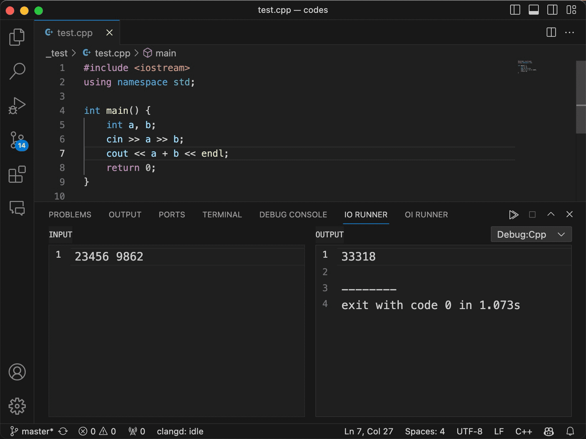

> [!IMPORTANT]
> This extension is not ready to use out of the box and is currently not actively maintained. Configurations may change, see [v2 plan](https://github.com/maxchang3/io-runner/issues/74) for details.

# IO Runner <sub>**WIP⚠️**</sub>

[简体中文](./README_CN.md)

<a href="https://marketplace.visualstudio.com/items?itemName=maxchang.io-runner" target="__blank"></a> 



Simplifies single-file code execution in VSCode.

* [x] Execute single-file code quickly.
* [x] Redirects input/output to separate views.
* [x] Execute launch configurations from `launch.json` and tasks from `tasks.json`.
* [x] Support [VSCode's configuration variables](https://code.visualstudio.com/docs/editor/variables-reference) in configuration. (By using [connor4312/vscode-variables](https://github.com/connor4312/vscode-variables), not fully implemented. [VSCode does not support it natively](https://github.com/microsoft/vscode/issues/2809)).
* [x] Automatically choose launch configurations based on file extensions, maintaining independent context environments for each file(non-persistent storage).
* [x] Automatically adapts to any theme in VSCode via CSS variables for better native compatibility.
* [ ] more...

This extension may still have the following issues to be resolved:

* [ ] Due to executing native tasks in VSCode, it is significantly slower than running commands directly.
    * Consider manually executing tasks by parsing the task configuration.
* [ ] CodeMirror has been introduced as an editor, but it seems unnecessary.
    * Consider simulating some features through a textarea would suffice, but for large texts, a virtual view/line number mechanism needs to be implemented.
    * Pray that VSCode provides Webview with the ability to use native editors.
* [ ] The pause mechanism for file execution is not elegant enough.

## Configuration Guide

Currently, this extension is **NOT** ready to use out of the box. It depends on configurations in `launch.json` and tasks specified in `tasks.json`.

### `io-runner.launchMap`

Map file extensions to launch configuration names, for example:

```jsonc
"io-runner.launchMap": {
    "c": [ "(lldb) Launch" ],
    "cpp": [ "(lldb) Launch" ]
}
```

### `io-runner.launchInterpreter`

Map the type of launch configuration to the interpreter for interpreted languages, for example:

```jsonc
"io-runner.launchInterpreter": {
    "python": "python3",
    "node": "node",
}
```

### `io-runner.defaultEncoding`

Default encoding for input/output. If you are using Windows with non-English language, you may need to set it to the encoding corresponding to your system language to display the correct language characters.

For example, Simplified Chinese users may need to set it to `gbk`. Japanese users may need to set it to `shift_jis`.

The values and their explanations can be selected directly in the settings(UI). You can also refer to [TextDecoder: encoding property](https://developer.mozilla.org/en-US/docs/Web/API/TextDecoder/encoding) or [package.json](https://github.com/maxchang3/io-runner/blob/main/package.json#L36) for more detailed information.

### `io-runner.timeout`

The maximum time allowed for the program to run. If the program does not complete within the specified time, it will be forcibly terminated.

Unit: milliseconds

Default: `10000` (10 seconds)

## Examples

For a better experience, it is better to set `reveal` in `presentation` to `slient` in the corresponding task in `tasks.json`.

```jsonc
    "presentation": {
        "reveal": "never"
    }, 
```

### Compiled Languages

For compiled languages, take C/C++ as an example， if you have the following launch configuration:

```jsonc
{
    "type": "lldb",
    "request": "launch",
    "name": "(lldb) Launch", // The value of name here corresponds to the value in launchMap below
    "preLaunchTask": "buildG++",
    "postDebugTask": "removeDevFolder",
    "program": "${fileDirname}/.dev/${fileBasenameNoExtension}.out",
    "args": [],
    "cwd": "${fileDirname}",
}
```

You need to add the following to io-runner.launchMap:

```jsonc
"io-runner.launchMap": {
    "c": [ "(lldb) Launch" ],
    "cpp": [ "(lldb) Launch" ]
}
```

When you open the IO Runner panel in a C/C++ file, you can choose `(lldb) Launch` to start the process. The extension will automatically execute the `buildG++` task (preLaunchTask), then run the output file specified in the program field. Finally, it will execute the `removeDevFolder` task (postDebugTask).


### Interpreted Languages

For languages that require an interpreter, such as Python, you have the following in `launch.json`:

```jsonc
{
    "type": "python", // The value of type here corresponds to the key of the interpreter below
    "request": "launch",
    "name": "Python: Current File",
    "program": "${file}",
    "console": "integratedTerminal"
}
```

You still need to configure in `io-runner.launchMap`:

```jsonc
"io-runner.launchMap": {
    "py": [ "Python: Current File" ],
}
```

Also, You need to configure in `io-runner.launchInterpreter` with the interpreter command matching the type field:

```jsonc
"io-runner.launchInterpreter": {
    "python": "python3",
}
```

Now, in a Python file, when you open the IO Runner panel, you can choose `Python: Current File` to start. The extension will automatically execute the python3 command, running the current file.

## Commands

* `io-runner.run` - Execute the current file
* `io-runner.stop` - Stop the current execution
* `io-runner.panel.focus` - Focus on the IO Runner panel

You can increase efficiency by binding these commands to shortcut keys.

## Credits

The project is heavily inspired by [CmdBlockZQG](https://github.com/CmdBlockZQG/)'s [OI Runner](https://github.com/CmdBlockZQG/oi-runner/).

Some components and [design tokens](https://www.fast.design/docs/design-systems/design-tokens/) are from [vscode-webview-ui-toolkit](https://github.com/microsoft/vscode-webview-ui-toolkit) to maintain a consistent appearance with VSCode's interface.

I employ [microsoft/fast](https://github.com/microsoft/fast) to develop the frontend interface because of its lightweight design, seamlessly integrated with vscode-webview-ui-toolkit's components.

## License

[MIT](https://github.com/maxchang3/io-runner/blob/main/LICENSE) License © 2023 [maxchang3](https://github.com/maxchang3)

This project is initialized by using the template [starter-vscode](https://github.com/antfu/starter-vscode).
